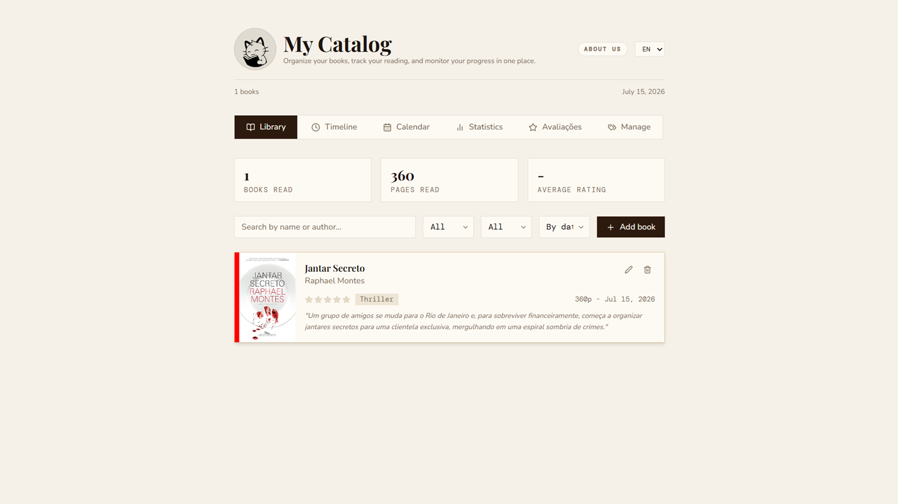

<p align="center">
  
</p>

<h1 align="center">Cat-alog</h1>

<p align="center">
  Organize your books, track your reading progress, and keep all your reading information in one place.
</p>

<p align="center">
  
  
  
  
</p>

---

## 📚 About

Cat-alog is a simple web application designed to help readers manage their personal library. Keep track of books you've read, books you're currently reading, and books you plan to read, all in one place.

---

## ✨ Features

- 📖 Add and manage your book collection
- 📊 Track reading progress
- ⭐ Rate your books
- ❤️ Mark favorite books
- 📝 Save personal notes and comments
- 📅 Record reading start and finish dates
- 👤 Organize books by author
- 🏷️ Categorize books by genre
- 🖼️ Store and display book covers
- 🔍 Browse and search your collection

## 📸 Preview

<p align="center">
  
</p>

---

## 🚀 Getting Started

### Prerequisites

Make sure you have installed:

- Node.js
- npm

---

### Installation

```bash
git clone https://github.com/your-username/book-tracking-app.git
cd book-tracking-app
npm install
```

### Run the project

```bash
npm run dev
```

The application should now be running locally.

## 📄 License

This project is available under the MIT License.

---

<p align="center">
  Made with ❤️ for my girlfriend and book lovers
</p>